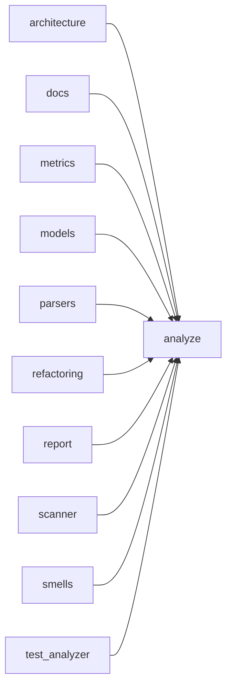
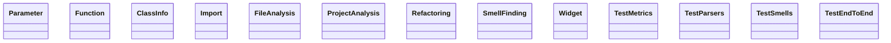

# Architecture Overview

## Project Statistics

| Language | Files | LOC | Functions | Classes |
|---|---|---|---|---|
| Python | 12 | 1856 | 105 | 13 |

**Total analyzed LOC**: 1856 · **Functions**: 105 · **Classes**: 13 · **Parse errors**: 0

## Module Dependency Graph



## Class Hierarchy



## Internal Call Structure (per module)

**`analyze.py`** (python, 20 LOC)

```
imports: argparse, sys, analyzer.report
  main(argv = None) -> int  [L14, cx=2]
```

**`analyzer/architecture.py`** (python, 101 LOC)

```
imports: os, collections, .models
  generate_architecture_doc(project: ProjectAnalysis) -> str  [L9, cx=1]
  _stats(project) -> list[str]  [L24, cx=2]
  _module_name(path) -> str  [L42, cx=1]
  _dep_graph(project) -> list[str]  [L46, cx=7]
  _resolve_local(imp, project)  [L72, cx=8]
  _class_diagram(project) -> list[str]  [L89, cx=7]
  _module_structure(project) -> list[str]  [L106, cx=6]
```

**`analyzer/docs.py`** (python, 114 LOC)

```
imports: os, .models
  generate_api_docs(project: ProjectAnalysis) -> str  [L8, cx=8]
  _class_doc(project) -> list[str]  [L40, cx=5]
  _function_doc(fn: Function, project, depth: int) -> list[str]  [L55, cx=8]
  _example(fn: Function, lang_ext: str) -> list[str]  [L109, cx=11]
  _rel(project, path) -> str  [L133, cx=1]
```

**`analyzer/metrics.py`** (python, 144 LOC)

```
imports: re
  cyclomatic_complexity(source: str, language: str) -> int  [L13, cx=1]
  nesting_depth(source: str, language: str) -> int  [L26, cx=13]
  strip_comments_and_strings(source: str, language: str = "python") -> str  [L69, cx=13]
  count_lines(source: str) -> tuple[int, int, int, int]  [L111, cx=9]
  count_try_catch(source: str) -> bool  [L143, cx=1]
  find_todos(source: str) -> list[str]  [L148, cx=2]
  extract_raises(source: str, language: str) -> list[str]  [L157, cx=4]
```

**`analyzer/models.py`** (python, 110 LOC)

```
imports: dataclasses, typing
class Parameter
class Function
class ClassInfo
class Import
class FileAnalysis
class ProjectAnalysis
  Parameter::signature() -> str  [L14, cx=4]
  Function::qualified_name() -> str  [L51, cx=2]
  Function::signature() -> str  [L54, cx=4]
  ProjectAnalysis::all_functions() -> list[Function]  [L106, cx=3]
  ProjectAnalysis::all_classes() -> list[ClassInfo]  [L110, cx=3]
  ProjectAnalysis::all_imports() -> list[Import]  [L114, cx=3]
  ProjectAnalysis::total_loc() -> int  [L118, cx=2]
  ProjectAnalysis::language_stats() -> dict  [L121, cx=2]
```

**`analyzer/parsers.py`** (python, 623 LOC)

```
imports: re, typing, .metrics, .models
  detect_language(path: str) -> Optional[str]  [L24, cx=6]
  _looks_like_c_header(path: str) -> bool  [L36, cx=1]
  _match_n(text: str, pattern: str) -> str  [L40, cx=2]
  analyze_file(path: str, source: str) -> FileAnalysis  [L45, cx=5]
  _parse_python(path: str, source: str) -> FileAnalysis  [L70, cx=14]
  owning_class(line_no: int) -> Optional[str]  [L90, cx=3]
  _python_block_end(lines: list[str], start: int, indent: int) -> int  [L156, cx=4]
  _decorators_before(lines: list[str], idx: int) -> str  [L170, cx=3]
  _py_docstring(body: str) -> Optional[str]  [L182, cx=2]
  _py_params(raw: str) -> list[Parameter]  [L187, cx=14]
  _parse_java(path: str, source: str) -> FileAnalysis  [L257, cx=13]
  owning_class(pos: int) -> Optional[str]  [L280, cx=3]
  _parse_typescript(path: str, source: str) -> FileAnalysis  [L359, cx=19]
  owning_class(pos: int) -> Optional[str]  [L380, cx=3]
  _parse_cpp(path: str, source: str) -> FileAnalysis  [L470, cx=15]
  owning_class(pos: int) -> Optional[str]  [L484, cx=3]
  _cpp_params(raw: str) -> list[Parameter]  [L547, cx=5]
  _java_ts_params(raw: str) -> list[Parameter]  [L568, cx=13]
  _build_function(*: any, name: str, file: str, line: int, end_line: int, params: list[Parameter], return_type, language: str, source: str, class_name = None, visibility = "public", is_static = False, is_abstract = False, is_constructor = False, docstring = None) -> Function  [L614, cx=2]
  _braces_end(source: str, open_pos: int) -> int  [L657, cx=12]
  _offset_of_line_end(source: str, line_no: int) -> int  [L688, cx=3]
  _block_comment_before(source: str, pos: int) -> Optional[str]  [L696, cx=3]
```

**`analyzer/refactoring.py`** (python, 268 LOC)

```
imports: textwrap, dataclasses, .models, .smells
class Refactoring
  Refactoring::suggest(project, findings: list[SmellFinding]) -> list[Refactoring]  [L20, cx=6]
  Refactoring::recipe_title(smell_id: str) -> str  [L48, cx=1]
  Refactoring::_sig(fn: Function) -> str  [L63, cx=8]
  Refactoring::_register(smell_id)  [L82, cx=1]
  Refactoring::_long_function(f: SmellFinding, fn: Function) -> Refactoring  [L91, cx=2]
  Refactoring::_apply_business_rules(data)  [L106, cx=1]
  Refactoring::_deep_nesting(f: SmellFinding, fn: Function) -> Refactoring  [L129, cx=1]
  Refactoring::process(user, order)  [L137, cx=5]
  Refactoring::process(user, order)  [L147, cx=4]
  Refactoring::_too_many_params(f: SmellFinding, fn: Function) -> Refactoring  [L161, cx=3]
  Refactoring::_high_complexity(f: SmellFinding, fn: Function) -> Refactoring  [L193, cx=1]
  Refactoring::dispatch(case, payload)  [L208, cx=3]
  Refactoring::_duplicate(f: SmellFinding, fn: Function) -> Refactoring  [L216, cx=1]
  Refactoring::shared_logic(...)  [L226, cx=1]
  Refactoring::original_a(...)  [L229, cx=1]
  Refactoring::original_b(...)  [L232, cx=1]
  Refactoring::_empty_catch(f: SmellFinding, fn: Function) -> Refactoring  [L240, cx=1]
  Refactoring::_magic_number(f: SmellFinding, fn: Function) -> Refactoring  [L267, cx=1]
  Refactoring::_long_line(f: SmellFinding, fn: Function) -> Refactoring  [L285, cx=1]
  Refactoring::_print_debug(f: SmellFinding, fn: Function) -> Refactoring  [L297, cx=1]
  Refactoring::_todo(f: SmellFinding, fn: Function) -> Refactoring  [L309, cx=1]
```

**`analyzer/report.py`** (python, 89 LOC)

```
imports: os, datetime, ., .architecture, .docs, .models, .refactoring, .scanner, .smells
  analyze_project(root: str) -> ProjectAnalysis  [L15, cx=1]
  generate_quality_report(project: ProjectAnalysis, findings) -> str  [L19, cx=5]
  run(root: str, out_dir: str = "docs/generated") -> dict  [L52, cx=2]
  _refactoring_doc(refactorings) -> str  [L79, cx=6]
  _summary_line(project, findings, refactorings, outputs)  [L98, cx=2]
```

**`analyzer/scanner.py`** (python, 36 LOC)

```
imports: os, sys, .models, .parsers
  scan(root: str, exclude_dirs = None) -> ProjectAnalysis  [L15, cx=8]
  _supported(filename: str) -> bool  [L36, cx=5]
```

**`analyzer/smells.py`** (python, 138 LOC)

```
imports: re, dataclasses, .metrics, .models, hashlib
class SmellFinding
  SmellFinding::detect_smells(project: ProjectAnalysis) -> list[SmellFinding]  [L44, cx=2]
  SmellFinding::_severity(score: int) -> str  [L52, cx=3]
  SmellFinding::_function_smells(fn: Function) -> list[SmellFinding]  [L60, cx=12]
  SmellFinding::add(smell_id: str, details: str, severity: str | None = None, line: int | None = None)  [L64, cx=1]
  SmellFinding::_duplicates(project: ProjectAnalysis) -> list[SmellFinding]  [L108, cx=6]
  SmellFinding::_normalize(source: str) -> str  [L144, cx=4]
  SmellFinding::smell_summary(findings: list[SmellFinding]) -> dict  [L154, cx=3]
```

**`tests/test_analyzer.py`** (python, 213 LOC)

```
imports: os, tempfile, unittest, analyzer.metrics, analyzer.models, analyzer.parsers, analyzer.report, analyzer.refactoring, analyzer.smells, analyzer.scanner, logging, tempfile
class Widget
class TestMetrics : unittest.TestCase
class TestParsers : unittest.TestCase
class TestSmells : unittest.TestCase
class TestEndToEnd : unittest.TestCase
  add(a: int, b: int = 1) -> int  [L19, cx=2]
  Widget::__init__(name: str)  [L27, cx=1]
  Widget::helper(x)  [L31, cx=1]
  TestMetrics::test_complexity_counts_branches()  [L37, cx=1]
  TestMetrics::test_comments_and_strings_stripped()  [L41, cx=1]
  TestMetrics::test_line_counts()  [L45, cx=1]
  TestMetrics::test_nesting()  [L51, cx=1]
  TestParsers::setUp()  [L56, cx=1]
  TestParsers::_write(name, src)  [L59, cx=2]
  TestParsers::test_language_detection()  [L66, cx=1]
  TestParsers::test_python_parse()  [L74, cx=6]
  TestParsers::test_java_parse()  [L92, cx=3]
  TestParsers::test_typescript_parse()  [L112, cx=5]
  TestParsers::test_cpp_parse()  [L129, cx=1]
  TestSmells::_fn_from_source(src, filename = "m.py")  [L149, cx=1]
  TestSmells::test_smells_detected()  [L153, cx=3]
  TestSmells::test_duplicates()  [L167, cx=2]
  TestSmells::test_refactoring_suggestions_generated()  [L189, cx=4]
  TestSmells::test_quality_report_renders()  [L202, cx=2]
  TestEndToEnd::test_full_run_generates_docs()  [L214, cx=3]
```

