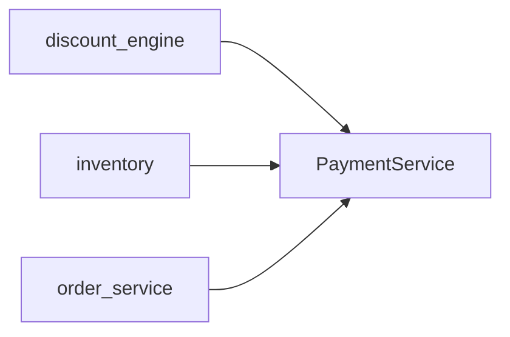
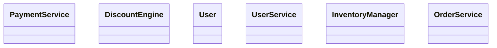

# Architecture Overview

## Project Statistics

| Language | Files | LOC | Functions | Classes |
|---|---|---|---|---|
| Cpp | 1 | 30 | 2 | 1 |
| Java | 1 | 32 | 3 | 1 |
| Python | 3 | 101 | 10 | 2 |
| Typescript | 1 | 31 | 4 | 2 |

**Total analyzed LOC**: 194 · **Functions**: 19 · **Classes**: 6 · **Parse errors**: 0

## Module Dependency Graph



## Class Hierarchy



## Internal Call Structure (per module)

**`PaymentService.java`** (java, 32 LOC)

```
imports: java.util.List, java.util.Map
class PaymentService
  PaymentService::authorizePayment(userId: String, amount: double, currency: String, method: String, retry: boolean) -> boolean  [L19, cx=6]
  PaymentService::doAuthorize(userId: String, amount: double, method: String) -> boolean  [L37, cx=3]
  PaymentService::capture(paymentId: String, metadata: List<String>) -> void  [L44, cx=1]
```

**`discount_engine.cpp`** (cpp, 30 LOC)

```
imports: string, vector, iostream
class DiscountEngine
  DiscountEngine::applyDiscount(price: double, tier: std::string, loyalty: bool, months: int) -> double  [L5, cx=6]
  DiscountEngine::logApplied(entries: std::vector<std::string>, label: std::string) -> void  [L29, cx=1]
```

**`ecommerce/inventory.py`** (python, 28 LOC)

```
imports: logging
class InventoryManager
  InventoryManager::__init__()  [L9, cx=1]
  InventoryManager::add_product(product_id: int, stock: int, price: float) -> None  [L14, cx=1]
  InventoryManager::check_stock(product_id: int) -> int  [L19, cx=1]
  InventoryManager::price_of(product_id: int) -> float  [L23, cx=1]
  InventoryManager::reserve(product_id: int, quantity: int) -> bool  [L27, cx=2]
  InventoryManager::release(order_id: int) -> bool  [L34, cx=1]
```

**`ecommerce/order_service.py`** (python, 73 LOC)

```
imports: logging, typing, .inventory
class OrderService
  OrderService::__init__(inventory: InventoryManager, discount_rate: float = 0.0)  [L12, cx=1]
  OrderService::place_order(user_id: int, product_id: int, quantity: int, currency: str = "USD", coupon_code: Optional[str] = None, rush: bool = False) -> dict  [L17, cx=8]
  OrderService::cancel_order(order_id: int, reason: str = "user request") -> bool  [L52, cx=1]
  OrderService::summarize_daily(orders: list, threshold: float = 100.0) -> dict  [L59, cx=11]
```

**`userService.ts`** (typescript, 31 LOC)

```
imports: none
interface User
class UserService
  normalizeEmail(raw: string) -> string  [L38, cx=1]
  UserService::registerUser(email: string, displayName: string, password: string, newsletter: boolean, tier: string) -> User  [L14, cx=1]
  UserService::findUser(id: number) -> User | undefined  [L22, cx=1]
  UserService::fetchProfile(url: string, timeoutMs: number) -> Promise<string>  [L26, cx=1]
```

